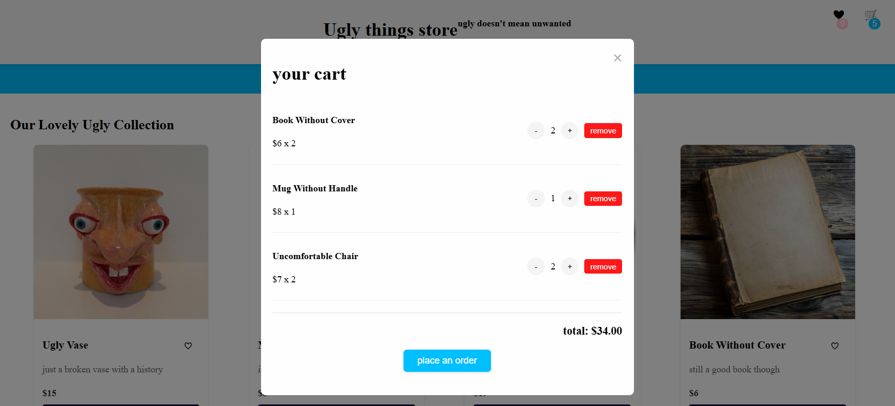
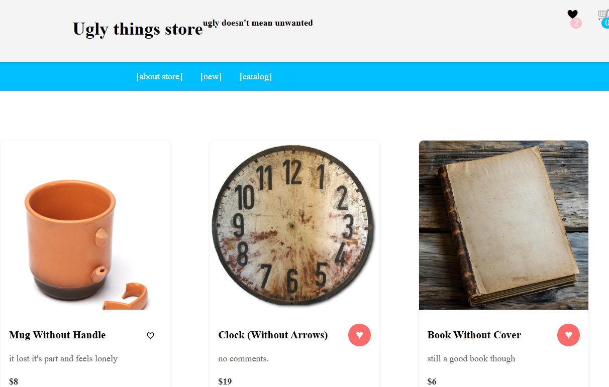

# web-lab1-shop

[Ugly Things Store](https://aleksashako.github.io/web-lab1-shop/) - созданный на чистом Java Script, HTML и CSS интернет-магазин. В его ассортимент входят забавные, немного глупые, а порой и бесполезные вещи, которые могут приобрести все желающие. 
Реализованы такие функции, как:
- добавление в корзину
- добавление в избранное
- заполнение и отправка формы заказа.

## Этапы разработки
### Макет и верстка

* Созданная HTML-страница (с использованием семантической разметки) магазина вещей: карточки вещей, название, небольшое описание, цена, кнопка «Add to cart».
  

* Форма открывается в модальном окне при нажатии на кнопку «place an order». Также она содержит такие поля как: имя, фамилия, адрес доставки, контактный номер телефона и кнопку «order!».

* Модальные окна «Избранного» и «Корзины» открываются по клику на символы в шапке страницы.

* Чтобы была возможность пользоваться сайтом на различных устройствах, реализован адаптивный дизайн с помощью медиазапросов.

Представлены скриншоты с планшета и смартфона.

> Дополнительно реализованы два раздела («about store» и «new»).

### Добавление логики

Логика корзины:
- при добавлении товара в корзину, отобржается общее число товаров как на карточке, так и на корзине

- реализовано изменение количество товаров в корзине, и добавлена кнопка удаления товара из корзины

> Все эти действия подкреплены изменением стоимости корзины, а также сохранением данных в localStorage (при обновлении страницы)

Логика избранного:

- при добавлении товара в избранное, отобржается общее число вещей в избранном, на карточке также показано, в избранном ли товар (красное сердце)
- удалять товар из избранного можно как на карточке, так и в модальном окне.

- в модальном окне также присутствует возможность добавить товар в корзину (количество на карточке, в молальном окне и в корзине - синхронизируется)

При нажатии кнопки «order!» показывается сообщение о том, что заказ сделан и можно возвращаться к просморту товаров. Корзина при этом очищается, а избранное - сохраняется.

